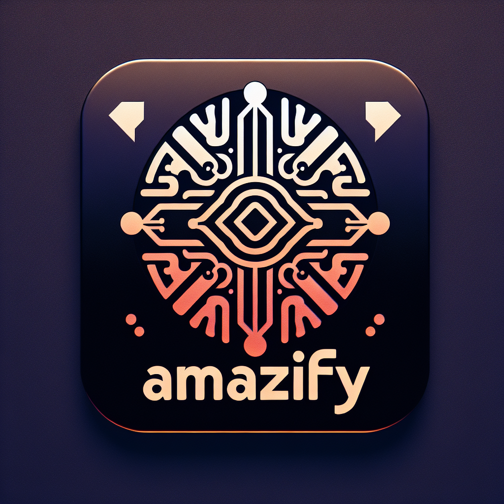

# 🎵 amazify



Migrate your playlists from Amazon Music to Spotify using a simple Flask web interface.

## Setup and Startup

### Spotify Authentication via OAuth

Navigate to [developer.spotify.com](https://developer.spotify.com/dashboard) and
create a new app. Use this as the callback URL:

```
http://127.0.0.1:5000/callback
```

### Amazon Authentication (Workaround)

Currently, the Amazon Music API won't let us create applications for OAuth ourselves without
them needing to be approved by Amazon. Since we only want to perform a one-time
migration, we can obtain an OAuth token via Amazon's own API reference, hence eliminating
the need for us to be able to create our own application.

Navigate to [dashboard.music.amazon.dev](https://dashboard.music.amazon.dev/console/api/get-playlist/)
and press the button `Get Token` in order to retrieve a valid token.
Login using your Amazon Music profile's credentials when prompted.

Copy the resulting token and set it as environment variable as described in the next step.
Make sure to also copy the `x-api-key` value as provided in the example `curl`
command given on Amazon's website as well.

### Required Environment Variables

Next set these environment variables. Get the client id and client
secret from the spotify app you have just created.

```shell
# client id and client secret of your spotify application
export SPOTIFY_CLIENT_ID=XXX
export SPOTIFY_CLIENT_SECRET=XXX
# token and x-api-key from the interactive amazon API reference
export AMAZON_TOKEN=XXX
# example: amzn1.application.72b599tbc0b549339095eb1234c3c7d1
export AMAZON_X_API_KEY=XXX
```

### Installation of Dependencies

Install the dependencies using pipenv:

```shell
pipenv install
```

### Startup

Start the flask server like this:

```shell
pipenv run python -m flask run
```

You can then open the webinterface under the URL `https://127.0.0.1:5000`.
Press the button for authenticating at Spotify before running any migration.
Errors will be printed in the Flask app's log, if any occurred.

## Caveats

The following limitations exist:

1. Do **not** run multiple migrations simultaneously. This will probably result in rate-limits being exceeded and the progress bar breaking.
2. The Amazon token will expire after about `30min`. Keep that in mind when running migrations.
3. The app does **not** check if a playlist with the same name already exists. A new playlist is created each time you start a migration.
4. If a song from the Amazon Playlist is not present in Spotify, the Spotify Search API might return false songs, which will then be added to the playlist. Make sure to check the result after the migration has finished.

